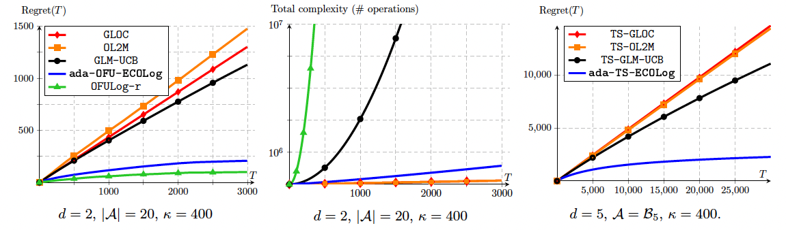

Code for the paper [_Jointly Efficient and Optimal Algorithms for Logistic Bandits_](https://arxiv.org/pdf/2201.01985.pdf), by [Louis Faury](https://www.louisfaury.com), Marc Abeille, Clément Calauzènes and [Kwang-Sung Jun](https://kwangsungjun.github.io).


# Install
Clone the repository and run:
```shell
$ pip install .
```

# Usage

This code implements the `adaECOLog` algorithms (OFU and TS variants) - both from the aforedmentioned paper, along with several baselines (oldest to newest):

- `GLM-UCB` from [Filippi et al. 2010](https://papers.nips.cc/paper/2010/file/c2626d850c80ea07e7511bbae4c76f4b-Paper.pdf),
- `OL2M` from [Zhang et al. 2016](http://proceedings.mlr.press/v48/zhangb16.pdf),
- `GLOC` from [Jun et al. 2017](https://proceedings.neurips.cc/paper/2017/file/28dd2c7955ce926456240b2ff0100bde-Paper.pdf),
- `LogUCB1` from [Faury et al. 2020](http://proceedings.mlr.press/v119/faury20a/faury20a.pdf),
- `OFULog-r` from [Abeille et al. 2021](http://proceedings.mlr.press/v130/abeille21a/abeille21a.pdf).


Experiments can be ran for several Logistic Bandit (_i.e_ structured Bernoulli feedback) environments, such as static and time-varying finite arm-sets, or inifinite arm-sets (_e.g._ unit ball).



## Single Experiment 
Single experiments (one algorithm for one environment) can be ran thanks to `scripts/run_example.py`. The script instantiate the algorithm and environment indicated in the file `scripts/configs/example_config.py` and plots the regret.

## Benchmark
Benchmarks can be obtained thanks to `scripts/run_all.py`. This script runs experiments for any config file in `scripts/configs/generated_configs/` and stores the result in `scripts/logs/`. 


## Plot results
You can use `scripts/plot_regret.py` to plot regret curves. This scripts plot regret curves for all logs in `scripts/logs/` that match the indicated dimension and parameter norm. 

```
usage: plot_regret.py [-h] [-d [D]] [-pn [PN]]

Plot regret curves (by default for dimension=2 and parameter norm=3)

optional arguments:
  -h, --help  show this help message and exit
  -d [D]      Dimension (default: 2)
  -pn [PN]    Parameter norm (default: 4.0)
```


## Generating configs 
You can automatically generate config files thanks to `scripts/generate_configs.py`. 

```
usage: generate_configs.py [-h] [-dims DIMS [DIMS ...]] [-pn PN [PN ...]] [-algos ALGOS [ALGOS ...]] [-r [R]] [-hz [HZ]] [-ast [AST]] [-ass [ASS]] [-fl [FL]]

Automatically creates configs, stored in configs/generated_configs/

optional arguments:
  -h, --help            show this help message and exit
  -dims DIMS [DIMS ...]
                        Dimension (default: None)
  -pn PN [PN ...]       Parameter norm (||theta_star||) (default: None)
  -algos ALGOS [ALGOS ...]
                        Algorithms. Possibilities include GLM-UCB, LogUCB1, OFULog-r, OL2M, GLOC or adaECOLog (default: None)
  -r [R]                # of independent runs (default: 20)
  -hz [HZ]              Horizon, normalized (later multiplied by sqrt(dim)) (default: 1000)
  -ast [AST]            Arm set type. Must be either fixed_discrete, tv_discrete or ball (default: fixed_discrete)
  -ass [ASS]            Arm set size, normalized (later multiplied by dim) (default: 10)
  -fl [FL]              Failure level, must be in (0,1) (default: 0.05)
```

For instance running `python generate_configs.py -dims 2 -pn 3 4 5 -algos GLM-UCB GLOC OL2M adaECOLog` generates configs in dimension 2 for `GLM-UCB`, `GLOC`, `OL2M` and `adaECOLog`, for environments (set as defaults) of ground-truth norm 3, 4 and 5.


